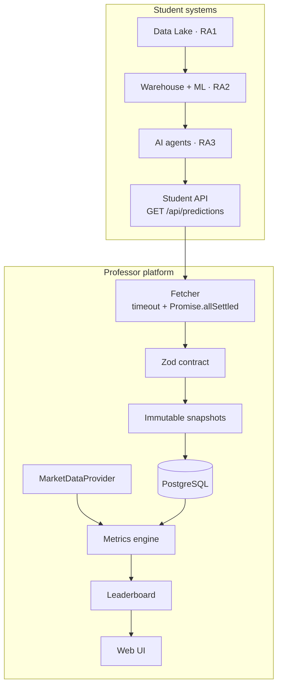

# Architecture

LaSalle Investing is one Next.js application. Students build the systems that feed it. The professor platform is the system of record.

## Diagram



```
STUDENT SYSTEMS
       ↓
Student APIs
       ↓
Professor Fetcher
       ↓
Validation
       ↓
Immutable Snapshots
       ↓
Central PostgreSQL
       ↓
Market Resolver
       ↓
Metrics Engine
       ↓
Leaderboard
       ↓
Web UI
```

## Two runtimes, one scoring path

| Mode | When | Data source |
| --- | --- | --- |
| `MOCK_MODE=true` | default, demos, first clone | `src/lib/mock/dataset.ts` |
| `MOCK_MODE=false` | live course | PostgreSQL via Drizzle |

Both produce the same `Dataset` shape. Pages call `getDataset()` and never branch on the provider. Metrics are pure functions of that shape.

## Directory map

```
src/
  app/                 pages and API routes
  components/          leaderboard, charts, admin, layout, ui
  config/              challenge rules, students, leaderboard weights
  db/                  Drizzle schema, migrations, seed
  lib/
    metrics/           hit rate, Brier, calibration, score
    market-data/       provider interface + mock + yahoo
    student-api/       fetch, concurrency, immutability
    validation/        Zod student contract
    dates/             resolution dates, market calendar
    mock/              deterministic season generator
    admin/             write path (fetch, lock, resolve)
    predictions/       outcome arithmetic
  data/mock/           exported CSV/JSON for the labs
docs/
  STUDENT_INTEGRATION.md
  ARCHITECTURE.md
  projects/            RA1 / RA2 / RA3 briefs + PDFs
tests/
```

## Central schema

| Table | Role |
| --- | --- |
| `students` | roster |
| `student_integrations` | base URL, endpoints, last fetch status |
| `model_versions` | v1 / v2 / v3 lineage |
| `prediction_cycles` | ISO weeks |
| `prediction_snapshots` | raw payload + hash + lock |
| `predictions` | normalised picks |
| `prediction_results` | prices, return, hit |
| `stocks` | teaching universe |
| `market_prices` | daily bars |
| `leaderboard_snapshots` | historical board as of a cycle |
| `weekly_winners` | podium record |
| `audit_logs` | append-only trail |

Nothing in the schema is Neon- or Supabase-specific.

## Integrity rules

1. A payload that fails Zod is not stored.
2. One student's timeout cannot fail the rest of the fetch.
3. A locked snapshot is never updated.
4. API keys live in environment variables, never in the browser, never in a row.
5. Resolution uses the closing price, not the high.

## Student pull flow

```
POST /api/admin/fetch-all
        │
        ▼
  fetchAllStudents()     concurrency 6, timeout per student
        │
        ▼
  validateStudentPayload()
        │
        ▼
  fetchAndStore()        refuse if locked_at is set
        │
        ▼
  prediction_snapshots + predictions   one transaction
        │
        ▼
  POST /api/admin/lock-cycle
```

## Scoring

`calculateLeaderboardScore()` in `src/lib/metrics` blends five components against the cohort, not against an absolute constant. Weights live in `src/config/leaderboard.ts`.

A hit is `realized_return >= 0.10`. Brier is the mean of `(p − y)²`. Calibration uses ten probability bins.

## Market data

```ts
interface MarketDataProvider {
  getPrice(ticker: string, date: Date): Promise<number>
}
```

`MARKET_DATA_PROVIDER=mock` reads the generated series. `yahoo` is a drop-in. Other vendors implement the same interface.

## Security

- Admin routes require `Authorization: Bearer $ADMIN_TOKEN`
- Student tokens are referenced by env-var name (`apiKeyEnvVar`)
- Fetch timeouts isolate a down student
- `NEXT_PUBLIC_NOINDEX` keeps preview deployments out of search
